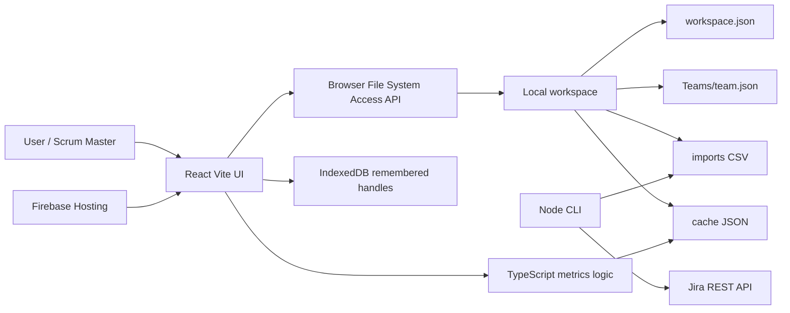

# Technical Architecture

## Technology stack

- Frontend: React 18, TypeScript, Vite, Recharts, lucide-react.
- Shared/domain logic: TypeScript modules under `apps/sm-tool/src/lib` and root `src`.
- CLI: Node.js/tsx TypeScript scripts for analysis and Jira pull.
- Tests: Vitest.
- Hosting config: Firebase Hosting for static build output.
- Storage: local filesystem workspace, browser IndexedDB for remembered handles, browser localStorage for Team view mode.

Tõendus: `package.json`, `apps/sm-tool/package.json`, `firebase.json`, `README.md`.

## Repository structure

- `apps/sm-tool`: React UI, UI-specific library code, styles and Vite config.
- `src`: CLI, Jira pull, workspace IO, shared contracts re-export.
- `tests`: Vitest regression tests for parser, metrics, Jira pull, workflow and UI normalization logic.
- `docs/commercial-handoff`: this handoff package.
- `Teams/`, `teams/`, `workspace.json`: real/local workspace data; not suitable for commit or commercial handoff.

## Frontend architecture

`apps/sm-tool/src/App.tsx` is the central UI container and contains dashboard logic, metric definitions, page routing state, period handling, team settings, import flows and computed health snapshots. `TeamDetail.tsx` renders Cycle Time scatter and SLE controls. Utility modules handle workspace IO, metrics, time-in-status parsing, periods, Jira query config, working-day calculations and SAFe mapping.

## Backend architecture

**Implemented:** no long-running SaaS backend exists. Root Node scripts act as local backend/CLI:

- `src/cli.ts`: analyzes local workspace and writes cache.
- `src/jira-pull.ts`: pulls Jira REST API data and writes CSV files.
- `src/io/workspace.ts`: loads workspace, parses CSV and writes cache.

**Planned:** hosted API, tenant-aware services, job queue, secret vault, database and scheduled imports.

## Database and data model

**Implemented local data model**

- `workspace.json`: workspace name, profiles, active profile, metric visibility.
- `Teams/<teamId>/team.json`: team config, workflow config, Jira queries, SLE config, exclusions, manual metrics.
- `Teams/<teamId>/imports/**/*.csv`: raw imported Jira/Time in Status CSV.
- `Teams/<teamId>/cache/*.json`: parsed issues, metrics, bottleneck auto, time-in-status auto, progress history.
- Browser IndexedDB stores remembered directory handles.

No server database exists.

## Authentication and authorization

Not implemented for the app. Jira CLI supports Basic or Bearer auth via environment variables/terminal input, but this authenticates to Jira only and does not create product identity or authorization.

Tõendus: `src/jira-pull.ts`, `README.md`, `renew-team.command`.

## AI model/API usage

Koodist ei paista AI model, OpenAI API, embeddings, prompt, vector store ega AI provider integration. AI usage status: **Planned / not implemented**.

## External integrations

- Jira REST API via `src/jira-pull.ts`.
- Firebase Hosting static deployment config via `firebase.json`.
- Browser File System Access API and IndexedDB.

No Stripe, email, Sentry, analytics, auth provider, object storage or database integration is visible.

## Deployment process

`npm run sm:build` builds the UI into `apps/sm-tool/dist`. `firebase.json` points Firebase Hosting to that directory and sets static headers/rewrites. This deploys only the static UI, not a SaaS backend.

## Environment variables

Visible from scripts and README, without values:

- `JIRA_URL`
- `JIRA_USERNAME`
- `JIRA_TOKEN`
- `JIRA_AUTH`
- `SM_TOOL_REPO_DIR`
- CLI options: workspace path, team selector, JQL, max issues, import bucket.

Do not store secrets in repo files.

## Testing approach

Vitest tests cover CSV parsing, metrics, SLE issue type behavior, moved issue handling, Jira pull builders/changelog paging, Time in Status parsing, working-day math, workspace IO, view mode, workflow detection, data monitor and UI metrics normalization.

Tõendus: `tests/*.test.ts`, `package.json`.

## Main technical debt

- `App.tsx` is very large and mixes UI, product rules and analytics helpers.
- SaaS-critical concerns are absent: backend, auth, database, tenant isolation, jobs, observability, billing.
- Real workspace data exists in local tree and must stay outside source distribution.
- Static hosting config may create a false sense of SaaS readiness.
- File System Access API limits browser support.

## Scalability risks

- Browser-local parsing and rendering can struggle with large Jira exports.
- CLI caps/defaults (`DEFAULT_MAX_ISSUES`, `HARD_MAX_ISSUES`) show current batch-oriented import limits.
- No background queue, incremental sync or multi-user conflict resolution.
- No centralized data model for cross-customer aggregation or admin reporting.

## Mermaid diagram

